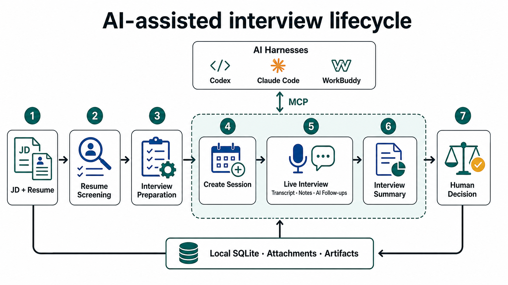

# 面试工作台

一个本地优先的实时面试辅助工具。它把浏览器麦克风音频发送给流式语音识别服务，在本机保存转录、简历、备注和面试场次；面试官可以随时提交最新一段转录，让大模型生成简短的**犀利追问**和**查漏提醒**。



工作台也可以通过 MCP 与 Codex、Claude Code、WorkBuddy 等 AI Harness 联动：AI 读取本机场次，完成简历筛选、面试准备、创建面试和面试总结，再把 Markdown 产物写回同一场次，面试结束后不需要手动导出转录。

## 功能

- 实时转录，支持说话人分离结果和就地改名
- 多面试场次、可自定义状态、计划面试时间和场次筛选
- PDF、DOCX 简历预览、缩放、最大化和位置备注
- JD 库、简历预分析和面试准备 Markdown
- 按片段提交的持久化 AI 任务，失败自动重试，服务重启后继续执行
- SQLite 本机存储，简历附件独立保存
- Markdown 单场导出、包含附件的完整 JSON 备份和恢复
- 默认仅监听本机；远程部署支持访问令牌和来源限制
- 本地 MCP Server 与四个通用 Agent Skills，支持无导出面试总结

当前内置的 ASR provider 是火山引擎，LLM provider 支持 OpenAI-compatible Chat Completions API，默认配置示例使用 DeepSeek。

## 快速开始

需要 Node.js 22.13 或更高版本。

```bash
npm ci
cp .env.example .env
npm run dev
```

在 `.env` 中至少配置一组火山 ASR 凭证和一个 LLM API Key，然后打开 [http://127.0.0.1:5173](http://127.0.0.1:5173)。

生产式本机运行：

```bash
npm run build
npm start
```

打开 [http://127.0.0.1:8787](http://127.0.0.1:8787)。

## AI Harness 联动

仓库内置四个通用 Skill：

- `interview-resume-screening`
- `interview-preparation`
- `interview-create-session`
- `interview-summary`

以 Codex 为例，启动工作台后连接本地 MCP Server 并安装 Skills：

```bash
codex mcp add interview-workbench \
  --env WORKBENCH_URL=http://127.0.0.1:8787 \
  -- node /absolute/path/to/interview-workbench/mcp/server.mjs

node scripts/install-skills.mjs codex
```

之后可以直接在 Codex 中要求“总结某场面试”。Skill 会分段读取完整转录和前置产物，并把报告保存回工作台。Claude Code、WorkBuddy 和其他 Harness 的配置见 [AI Harness 接入说明](docs/AI_HARNESS_INTEGRATION.md)。

## 配置

主要环境变量见 [.env.example](.env.example)：

| 变量 | 用途 |
| --- | --- |
| `HOST` / `PORT` | 服务监听地址，默认 `127.0.0.1:8787` |
| `WORKBENCH_DATA_DIR` | SQLite、附件、备份和日志目录 |
| `WORKBENCH_ACCESS_TOKEN` | 非本机监听时必填 |
| `WORKBENCH_ALLOWED_ORIGINS` | 允许访问 API 和 WebSocket 的网页来源 |
| `VOLCENGINE_ASR_*` | 火山引擎流式 ASR 配置 |
| `LLM_*` 或 `DEEPSEEK_*` | OpenAI-compatible LLM 配置 |

API Key 只保存在服务端环境中。远程模式下，网页要求输入连接口令，口令仅保存在当前浏览器会话。

## 数据与备份

默认数据目录是 `data/`：

```text
data/
  workbench.sqlite
  attachments/
  backups/
  logs/
```

升级旧版本时，服务会把 `data/interview-store.json` 自动迁移到 SQLite，先创建时间戳备份，并保留原文件。右上角菜单可以导出或导入包含简历附件的完整 JSON 备份。导入前，服务还会自动创建一份 SQLite 快照。

筛选报告、面试准备和面试总结保存在 SQLite 的场次产物中；AI Harness 的会话 ID 也按场次记录。相同类型的产物再次保存时会覆盖当前版本，完整备份会一起包含这些数据。

`data/`、`.env`、日志和本地招聘材料已从 Git 与打包产物中排除。发布前仍应运行 `npm run release:check`。

## 安全与隐私

麦克风音频会发送给 ASR provider；点击“立即追问”后，所选转录、JD、简历预分析和历史问题会发送给 LLM provider。简历原文件不会发送给 LLM。请在使用前确认已取得适用法律和组织政策要求的录音或转录同意。

默认部署只适合单用户本机使用。不要把开发服务直接暴露到公网。远程访问必须配置访问令牌、严格来源列表和 HTTPS 反向代理。详见 [PRIVACY.md](PRIVACY.md) 和 [SECURITY.md](SECURITY.md)。

## 开发

```bash
npm run check
npm test
npm run build
```

架构和扩展边界见 [ARCHITECTURE.md](ARCHITECTURE.md)，贡献约定见 [CONTRIBUTING.md](CONTRIBUTING.md)。

## 已知边界

- 浏览器只能采集所选麦克风。电脑会议使用外放时可被麦克风收音，但质量受回声消除、外放音量和环境影响；当前没有系统音频直采。
- 当前是单用户、本机优先架构，不提供团队账号、权限分级或云同步。
- DOCX 使用抽取文本预览，不能完全还原 Word 排版；PDF 预览更稳定。

## License

Apache License 2.0。详见 [LICENSE](LICENSE)。
