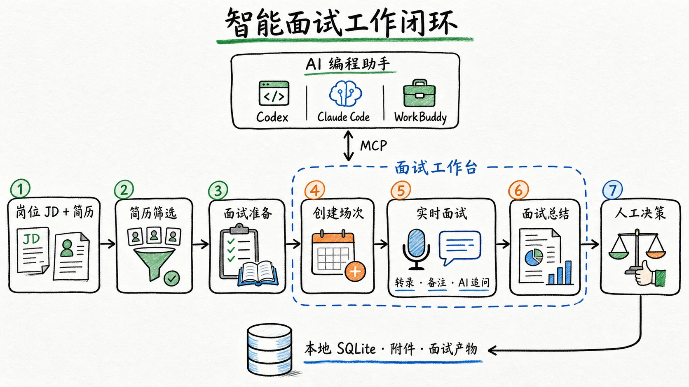

# 面试工作台

一个本地优先的实时面试辅助工具。它把浏览器采集的麦克风和会议声音发送给流式语音识别服务，在本机保存转录、简历、备注和面试场次；面试官可以随时提交最新一段转录，让大模型生成简短的**犀利追问**和**查漏提醒**。



工作台也可以通过 MCP 与 Codex、Claude Code、WorkBuddy 等 AI 编程助手联动：AI 读取本机场次，完成简历筛选、面试准备、创建面试和面试总结，再把 Markdown 产物写回同一场次，面试结束后不需要手动导出转录。

## 功能

- 实时转录，支持麦克风、会议声音双路采集、说话人分离结果和就地改名
- 多面试场次、可自定义状态、计划面试时间和场次筛选
- PDF、DOC、DOCX 简历预览、替换、缩放、最大化和位置备注
- JD 库、简历预分析和面试准备 Markdown
- 按片段提交的持久化 AI 任务，失败自动重试，服务重启后继续执行
- SQLite 本机存储，简历附件独立保存
- Markdown 单场导出、包含附件的完整 JSON 备份和恢复
- 默认仅监听本机；远程部署支持访问令牌和来源限制
- 本地 MCP 服务与四个通用 Agent Skill，支持无导出面试总结

当前内置的 ASR 服务适配器是火山引擎，LLM 服务适配器支持兼容 OpenAI Chat Completions 的接口，默认配置示例使用 DeepSeek。

## 快速开始

需要 Node.js 22.13 或更高版本。

```bash
npm ci
npm run dev
```

打开 [http://127.0.0.1:5173](http://127.0.0.1:5173)，点击顶部**配置**，填写火山引擎和大模型 API Key。配置保存在本机并立即生效，不需要编辑文件或重启服务。

生产式本机运行：

```bash
npm run build
npm start
```

打开 [http://127.0.0.1:8787](http://127.0.0.1:8787)。

## 收音方式

顶部可以选择两种收音方式：

- **麦克风**：只采集当前麦克风，适合线下面试，或将电脑会议外放后由麦克风统一收音。
- **会议声音**：同时采集麦克风和腾讯会议等桌面应用的声音。点击开始后，在浏览器共享面板中选择腾讯会议窗口或整个屏幕，并开启共享音频。

会议声音模式需要浏览器在每次开始时重新授权。工作台只使用共享流中的音频轨，不上传或保存屏幕画面。建议使用最新版 Chrome；如果共享面板没有音频选项，可改选整个屏幕，或回到麦克风模式。

## AI 编程助手联动

仓库内置四个通用 Agent Skill：

- `interview-resume-screening`
- `interview-preparation`
- `interview-create-session`
- `interview-summary`

以 Codex 为例，启动工作台后连接本地 MCP 服务并安装 Skill：

```bash
codex mcp add interview-workbench \
  --env WORKBENCH_URL=http://127.0.0.1:8787 \
  -- node /absolute/path/to/interview-workbench/mcp/server.mjs

node scripts/install-skills.mjs codex
```

之后可以直接在 Codex 中要求“总结某场面试”。Skill 会分段读取完整转录和前置产物，并把报告保存回工作台。Claude Code、WorkBuddy 和其他 AI 编程助手的配置见 [AI 编程助手接入说明](docs/AI_HARNESS_INTEGRATION.md)。

## 配置

普通用户直接使用网页里的**配置**入口：

- 火山引擎：填写新版 API Key；使用旧版控制台时也可以展开填写 App Key 和 Access Key
- 大模型：填写 API Key；DeepSeek API 地址和默认模型已经预填
- 高级参数默认折叠，通常不需要修改

网页不会读取或显示已经保存的密钥。密钥保存在本机 SQLite 中，不会进入完整 JSON 导出；再次保存时留空即可保留原密钥。

`.env` 只用于启动和高级部署。完整示例见 [.env.example](.env.example)：

| 变量 | 用途 |
| --- | --- |
| `HOST` / `PORT` | 服务监听地址，默认 `127.0.0.1:8787` |
| `WORKBENCH_DATA_DIR` | SQLite、附件、备份和日志目录 |
| `WORKBENCH_ACCESS_TOKEN` | 非本机监听时必填 |
| `WORKBENCH_ALLOWED_ORIGINS` | 允许访问 API 和 WebSocket 的网页来源 |
| `VOLCENGINE_ASR_*` | 可选，为网页配置提供火山引擎默认值 |
| `LLM_*` 或 `DEEPSEEK_*` | 可选，为网页配置提供大模型默认值 |

环境变量仍适合自动化部署。网页中保存的 provider 配置优先于对应环境变量；删除网页保存值后会回退到环境变量。远程模式下，网页要求输入连接口令，口令仅保存在当前浏览器会话。

## 数据与备份

默认数据目录是 `data/`：

```text
data/
  workbench.sqlite
  attachments/
  backups/
  logs/
```

升级旧版本时，服务会把 `data/interview-store.json` 自动迁移到 SQLite，先创建时间戳备份，并保留原文件。右上角菜单可以导出或导入包含简历附件的完整 JSON 备份。导入前，服务还会自动创建一份 SQLite 快照。

筛选报告、面试准备和面试总结保存在 SQLite 的场次产物中；AI 编程助手的会话 ID 也按场次记录。相同类型的产物再次保存时会覆盖当前版本，完整备份会一起包含这些数据。网页保存的服务密钥不会进入 JSON 导出，但 SQLite 快照会包含本机配置。

`data/`、`.env`、日志和本地招聘材料已从 Git 与打包产物中排除。发布前仍应运行 `npm run release:check`。

## 安全与隐私

麦克风音频以及会议声音模式下所选窗口的音频会发送给 ASR provider；屏幕画面不会发送或保存。点击“立即追问”后，所选转录、JD、简历预分析和历史问题会发送给 LLM provider。简历原文件不会发送给 LLM。请在使用前确认已取得适用法律和组织政策要求的录音或转录同意。

默认部署只适合单用户本机使用。不要把开发服务直接暴露到公网。远程访问必须配置访问令牌、严格来源列表和 HTTPS 反向代理。详见 [PRIVACY.md](PRIVACY.md) 和 [SECURITY.md](SECURITY.md)。

## 开发

```bash
npm run check
npm test
npm run build
```

架构和扩展边界见 [ARCHITECTURE.md](ARCHITECTURE.md)，贡献约定见 [CONTRIBUTING.md](CONTRIBUTING.md)。

## 已知边界

- 会议声音采集依赖操作系统和 Chromium 浏览器提供的共享音频能力，需要用户每次明确授权；不同系统和共享目标可用的音频选项可能不同。
- 会议中的远端声音会作为一路混合音频进入 ASR；说话人分离由 ASR 推断，不能保证与腾讯会议的参会者身份一一对应。
- 当前是单用户、本机优先架构，不提供团队账号、权限分级或云同步。
- DOC、DOCX 使用本地抽取文本预览，不能完全还原 Word 排版；PDF 预览更稳定。

## 许可证

Apache License 2.0。详见 [LICENSE](LICENSE)。
